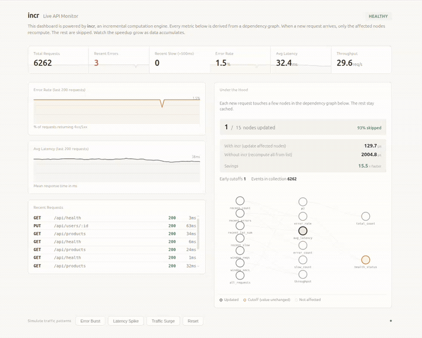

# incr

Most software recomputes everything from scratch whenever anything changes. Your CI rebuilds the whole project when you edit one file, your dashboard re-queries the whole database when one row updates. There are domain-specific fixes for this (React diffs the DOM, Salsa caches compiler queries, Materialize does incremental SQL) but if you just want to make your own code incremental, theres nothing to reach for.

incr is a crack at solving that. Its a Rust library (with Python bindings) that tracks dependencies between computations automatically and only reruns what's actually affected by a change.



## Quick look

You've got two ways to use it. Function graphs let you wire up computations that depend on each other:

```python
from incr import Runtime

rt = Runtime()
width = rt.create_input(10.0)
height = rt.create_input(5.0)
area = rt.create_query(lambda rt: rt.get(width) * rt.get(height))

rt.get(area)  # 50.0
rt.set(width, 12.0)
rt.get(area)  # 60.0, height wasnt touched, only area reran
```

And then theres incremental collections, which is where it gets more interesting. You set up a pipeline of operators, and when you insert or delete a row, only that row flows through. The engine doesnt re-examine existing data.

```python
# Travel premium calculation: sort visits by time, compute gaps
# between consecutive visits, sum the premiums
visits = rt.create_collection()
sorted_visits = visits.sort_by_key(lambda v: v.time)
pairs = sorted_visits.pairwise()
gaps = pairs.map(lambda pair: distance(pair[0], pair[1]))
total = gaps.reduce(lambda elements: sum(elements))

visits.insert(visit_at_9am)
visits.insert(visit_at_2pm)
visits.insert(visit_at_11am)
rt.get(total)  # computes all distances

# Move one visit: only the two affected segments recompute
visits.delete(visit_at_11am)
visits.insert(visit_at_11am_moved_to_noon)
rt.get(total)  # only recomputes 2 of 3 distances
```

The pipeline supports sort, pairwise (consecutive pairs from sorted data), map, filter, reduce, and count. The two APIs share the same dependency graph under the hood so you can have a function query that reads from a collection's reduce and it all stays incremental.

## Benchmarks

We run these head-to-head against Salsa (the incremental engine in rust-analyzer) on the same machine, same workloads. Not cherry-picked.

| Workload | incr | Salsa |
|----------|------|-------|
| Diamond graph, change input and propagate through 4 nodes | 752 ns | 1,066 ns |
| Early cutoff (input changes but clamped output doesnt) | 445 ns | 469 ns |
| Per-node propagation cost in a chain | ~175 ns/node | ~387 ns/query |

Collection insert vs just recomputing the whole pipeline from scratch:

| Collection size | Incremental | From scratch | Speedup |
|----------------|-------------|-------------|---------|
| 1K elements | 798 ns | 2.5 us | 3x |
| 10K elements | 1.0 us | 14.2 us | 14x |
| 100K elements | 818 ns | 152 us | 186x |

The interesting thing in that second table is the incremental column barely moves as the collection grows. 818 ns for 100K is almost the same as 798 ns for 1K because we're only touching the new row, not scanning the existing ones.

## How it works internally

Calling `rt.set()` on an input eagerly marks downstream nodes as potentially dirty (just flipping bits, no recomputation). Then when you `rt.get()` a result, the engine walks backwards from what you asked for, checks if each dirty node's dependencies actually changed, and only reruns the ones that need it. If a node reruns but produces the same value it had before, propagation stops there, and thats the "early cutoff" you see in the benchmarks.

For collections its a bit different. Each pipeline stage keeps a read offset into the upstream's change log. When triggered, it just reads entries past that offset, processes them, and advances the pointer. Inserting one row into a 100K collection means each stage does O(1) work regardless of collection size.

## Testing

We use proptest to generate thousands of random computation graphs, apply random mutations, and check that the incremental result matches what you'd get by recomputing everything from scratch. Thats the core correctness guarantee: if those two ever disagree on any random input, proptest shrinks it down to a minimal failing case.

96 tests total across Rust and Python, including 6,000 property-based test cases that verify every operator (filter, map, count, reduce, sort, pairwise) produces the same result incrementally as recomputing from scratch.

## Getting started

Rust:
```toml
[dependencies]
incr-core = { path = "crates/incr-core" }
```

Python (not on PyPI yet, build from source):
```bash
cd incr
uv venv .venv && uv pip install maturin pytest
source .venv/Scripts/activate
maturin develop
python -c "from incr import Runtime; print('ok')"
```

Running the tests:
```bash
cargo test -p incr-core       # rust
pytest ./examples/tests/python/        # python
cargo bench -p incr-core       # benchmarks
```

## Where this is at

Early stage. The engine works and the numbers are good but the API isnt stable yet.

The function DAG with automatic dependency tracking, early cutoff, and dynamic dependencies has been through thousands of property test cases and is solid. Collections support filter, map, count, sort_by_key, pairwise, and reduce, all delta-based. Python bindings work through PyO3.

There are two demos that show different aspects of the library:

- `examples/dashboard/` is a live API monitoring dashboard with dependency graph visualization and real-time tracing of which nodes recompute vs get skipped.
- `examples/travel-premium/` is a mobile worker scheduling demo that computes travel premiums incrementally using the full operator pipeline (sort, pairwise, map, reduce). Its backed by SQLite for persistence, with a distance cache that survives server restarts, and shows 5-8x speedup over batch recomputation when the map step involves expensive operations like distance lookups.

In Rust, per-node propagation costs about 175ns and collection operations stay nearly constant regardless of collection size. The real advantage shows up when pipelines include expensive operations like API calls or complex calculations, because incr tells you exactly which elements changed so you can skip the expensive work for everything else. The combination of function DAGs and incremental collections in one runtime is something the existing tools (Salsa, Differential Dataflow, Jane Street Incremental) dont offer individually.

Through the Python bindings, the per-call overhead of crossing the Rust/Python boundary means incr only outperforms naive Python for larger datasets or pipelines where each element involves real work. For pure in-memory arithmetic on small collections under about 5K elements, batch recomputation is faster because the pipeline traversal overhead dominates.

Joins and group-by for collections are not yet implemented, the runtime is single-threaded and the `Runtime` type cannot currently be shared across threads, garbage collection for long-running graphs is an open problem, and we havent published to crates.io or PyPI.

The travel premium demo also validates an integration pattern worth noting: incr graphs work well as ephemeral materialized views over database slices. You load a small scope from the database, build the incr pipeline over it, mutate both the DB and the graph together, and read computed results from incr. Expensive intermediate results (like distance caches) can be persisted separately so that rebuilding the graph after a restart is fast.

## Background and references

The core theory goes back to Umut Acar's PhD thesis on [self-adjusting computation](https://www.cs.cmu.edu/~rwh/students/acar.pdf) at Carnegie Mellon around 2005. He showed you can take arbitrary functional programs, track their dependencies at runtime, and replay only the parts affected by a change. The problem was overhead: the initial run was 2-30x slower, and memory usage exploded because you had to keep the whole dependency graph around. Nobody really figured out how to make it practical at the time.

A few years later, [Adapton](https://dl.acm.org/doi/10.1145/2594291.2594324) (PLDI 2014) introduced demand-driven incremental computation, where the key idea is that you dont recompute eagerly when inputs change, you just mark things dirty and only recompute when someone asks for a result. That's the approach we use for the function DAG side.

On the collections side, the big influence is Frank McSherry's [Differential Dataflow](https://www.cidrdb.org/cidr2013/Papers/CIDR13_Paper111.pdf) (CIDR 2013), which represents collections as streams of differences (+1/-1 for inserts/deletes) and propagates those differences through operators. Materialize built a whole company around this for SQL. Our delta-log approach is a simplified version of the same idea.

The systems we benchmark against and learned from:

- [Salsa](https://salsa-rs.github.io/salsa/) powers rust-analyzer's incremental analysis. It uses a "red-green" algorithm with dual timestamps for early cutoff, which we borrowed; our `verified_at` / `changed_at` design comes directly from studying how Salsa works.
- [Jane Street's Incremental](https://blog.janestreet.com/introducing-incremental/) is an OCaml library that went through [seven implementations](https://www.janestreet.com/tech-talks/seven-implementations-of-incremental/) before they got it right. Their ~30ns per-node firing cost was our original performance target.
- [Build Systems a la Carte](https://www.cambridge.org/core/journals/journal-of-functional-programming/article/build-systems-a-la-carte-theory-and-practice/097CE52C750E69BD16B78C318754C7A4) (Mokhov, Mitchell, Peyton Jones, JFP 2020) provided the theoretical framework showing that build systems and incremental computation are the same problem viewed from different angles.

Y. Annie Liu's 2024 survey [Incremental Computation: What Is the Essence?](https://arxiv.org/abs/2312.07946) is probably the best current overview of the whole field if you want to understand where all these approaches fit relative to each other. One of her key findings is that fully general incrementalization is provably undecidable, which is why every practical system (including ours) picks a restricted but useful subset of computations to handle.

None of the existing systems combine function DAGs with incremental collections in a single engine, which is what incr tries to do. Whether that actually works out as a general purpose tool is still an open question, but the early results are encouraging.
