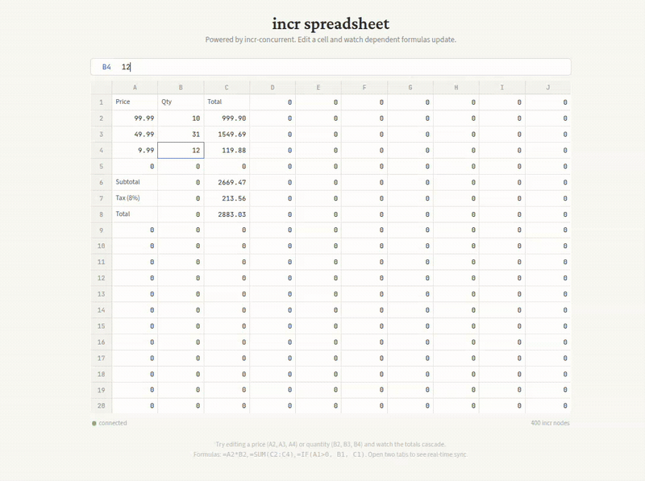

# incr

 [](https://crates.io/crates/incr-compute)
 [](https://crates.io/crates/incr-concurrent)
 [](https://crates.io/crates/incr-kube)
 [](https://pypi.org/project/incr-compute/)
 [](https://pypi.org/project/incr-concurrent/)
[](https://github.com/Anyesh/incr/actions?query=workflow%3ACI)


Most software recomputes everything from scratch whenever anything changes. Your CI rebuilds the whole project when you edit one file, your dashboard re-queries the whole database when one row updates. There are domain-specific fixes for this (React diffs the DOM, Salsa caches compiler queries, Materialize does incremental SQL) but if you just want to make your own code incremental, theres nothing to reach for.

incr is a crack at solving that. It's a Rust library (with Python bindings, `pip install incr-compute` or `incr-concurrent`) that tracks dependencies between computations automatically and only reruns what's actually affected by a change. The engine lives in `incr-core` and is parameterized over a concurrency strategy; two surface crates expose it: `incr-compute` (`Local` strategy, single-threaded, zero atomic-fence cost) and `incr-concurrent` (`Shared` strategy, `Send + Sync`: reader threads pull values while a writer mutates, with hazard-pointer-protected reads that can never tear). Same public API, one-line dependency swap.



## Quick look

You've got two ways to use it. Function graphs let you wire up computations that depend on each other:

```rust
use incr_compute::Runtime;

let rt = Runtime::new();
let width = rt.create_input(10.0_f64);
let height = rt.create_input(5.0_f64);
let area = rt.create_query(move |rt| rt.get(width) * rt.get(height));

rt.get(area);          // 50.0
rt.set(width, 12.0);
rt.get(area);          // 60.0 — height wasn't touched, only area reran
```

And then theres incremental collections, which is where it gets more interesting. You set up a pipeline of operators, and when you insert or delete a row, only that row flows through. The engine doesnt re-examine existing data.

```rust
use incr_compute::{Runtime, IncrCollection};

let rt = Runtime::new();
let visits: IncrCollection<Visit> = rt.create_collection();
let sorted = visits.sort_by_key(&rt, |v| v.time);
let pairs = sorted.pairwise(&rt);
let gaps = pairs.map(&rt, |pair| distance(&pair.0, &pair.1));
let total = gaps.aggregate(&rt, 0.0, |g| *g, |a, b| a + b);

visits.insert(&rt, visit_at_9am);
visits.insert(&rt, visit_at_2pm);
visits.insert(&rt, visit_at_11am);
rt.get(total);   // computes all distances

// Move one visit: only the two affected segments recompute.
visits.delete(&rt, &visit_at_11am);
visits.insert(&rt, visit_at_11am_moved_to_noon);
rt.get(total);
```

Ten operators ship: `filter`, `map`, `count`, `aggregate`, `reduce`, `sort_by_key`, `pairwise`, `window`, `group_by`, `join`. All of them do work proportional to the change, not the collection: `aggregate` maintains a balanced tree of partial folds (O(log n) per row, even for non-invertible folds like max), and `pairwise`/`window` consume positional deltas so one row touches a constant number of pairs. The one deliberate exception is `reduce`, which runs an arbitrary fold over a snapshot, because an arbitrary fold has no structure to exploit; reach for `aggregate` when your fold is associative. The function-DAG API and the collection API share the same dependency graph, so a function query can read a collection's `aggregate` and stay incremental end to end.

Beyond operators: nodes can be deleted (`delete_node`, with generation-checked handles so stale handles fail loudly and slots recycle), and `observe`/`stabilize` give you batch change notifications without polling individual nodes.

## Three crates, one engine

| | `incr-compute` | `incr-concurrent` | `incr-core` |
|---|---|---|---|
| Role | User-facing surface | User-facing surface | Shared engine |
| Thread safety | Single-threaded (`!Send + !Sync`) | `Send + Sync`, shareable across threads | Strategy-parameterized |
| Backing | `Cell`/`RefCell` (no atomics) | `Atomic*` + `RwLock` | `Cells` trait |
| Rust | `cargo add incr-compute` | `cargo add incr-concurrent` | (used via the wrappers) |

Both surface crates re-export `incr_core::Runtime<Local>` and `incr_core::Runtime<Shared>` respectively. The compiler monomorphizes both paths from the same source, so neither crate subsidizes the other: single-threaded users pay no atomic-fence cost; concurrent users pay no extra indirection for the lock-free read path. The asm of `Local`'s hot path is byte-identical to direct field access (validated on the spike branch and preserved through the type alias).

If you start with `incr-compute` and later need thread safety, swap the dependency. The `Value` bound (`Clone + PartialEq + Send + Sync + 'static`) is identical between crates, so user types do not need a per-crate impl.

## Benchmarks

Reproducible from this repo: `cargo bench -p incr-bench --bench salsa_compare` runs the same workloads through incr and through [Salsa](https://salsa-rs.github.io/salsa/) 0.27 (the incremental engine in rust-analyzer). Numbers below are from that harness with `--quick` on one machine; rerun it on yours.

| Workload | `incr-compute` | `incr-concurrent` | Salsa |
|----------|----------------|---------------------|-------|
| Chain propagation, 100 nodes | 10.8 µs (~108 ns/node) | 34.8 µs (~348 ns/node) | 37.5 µs (~375 ns/query) |
| Diamond graph, propagate through 4 nodes | 499 ns | 1.39 µs | 795 ns |
| Early cutoff (input changes, clamped output doesn't) | 268 ns | 685 ns | 383 ns |

Read it honestly: `incr-compute` beats Salsa 1.4x to 3.5x on every shape. `incr-concurrent` lands at Salsa parity on propagation and behind it on small graphs, and that cost buys something Salsa rules out by construction: Salsa mutation takes `&mut db` (no readers during writes), while `incr-concurrent` serves concurrent readers throughout, with every value read tear-free behind hazard pointers. If you do not need concurrent readers, use `incr-compute` and keep the speed.

Collection pipeline (`filter` → `map` → `count`), one insert vs from-scratch batch (`cargo bench -p incr-core --bench operators`):

| Collection size | `incr-compute` insert | From scratch | Speedup |
|----------------|----------------------|--------------|---------|
| 1K elements    | 557 ns               | 101 µs       | ~180x   |
| 10K elements   | 632 ns               | 66 µs        | ~105x   |
| 100K elements  | 662 ns               | 146 µs       | ~220x   |

The interesting thing in that second table is the `incr-compute` column barely moves as the collection grows. 662 ns at 100K is essentially the same as 557 ns at 1K because we're only touching the new row, not scanning the existing ones.

## How it works internally

Calling `rt.set()` on an input eagerly marks downstream nodes as potentially dirty (just flipping bits, no recomputation). Then when you `rt.get()` a result, the engine walks backwards from what you asked for, checks if each dirty node's dependencies actually changed, and only reruns the ones that need it. If a node reruns but produces the same value it had before, propagation stops there, and thats the "early cutoff" you see in the benchmarks.

For collections each pipeline stage keeps a read offset into the upstream's change log. When triggered, it just reads entries past that offset, processes them, and advances the pointer. Inserting one row into a 100K collection means each stage does O(1) work regardless of collection size. The logs do not grow forever: stages register their cursors with the upstream log, which periodically drops the prefix every consumer has passed (and drops everything if no consumer is attached), so log memory is bounded by consumer lag, not collection lifetime. A stage attached to an already-populated collection bootstraps from a snapshot instead of replaying history.

User closures (predicates, mappers, key extractors) never run while an engine lock is held: each stage clones the pending deltas out, evaluates your code, and applies the staged results plus the cursor advance together. A closure that panics (or raises, in Python) applies nothing and the batch replays exactly once after recovery.

The engine itself lives in [`incr-core`](crates/incr-core/) under a `Cells` strategy trait. `Local` backs every cell with `std::cell::Cell` and gives you a `!Send + !Sync` runtime with no atomic ops. `Shared` backs every cell with the matching atomic type and uses Acquire/Release for state-visibility transitions. The trait inlines through every call site (`#[inline(always)]`), so the compiler emits the same code for `Runtime<Local>` operations as it would for direct `Cell::get()` calls. The 64-byte cache-line layout for `NodeData` is preserved under both strategies by const-time assertions.

## Getting started

**Rust:**

```toml
[dependencies]
incr-compute = "0.2"      # single-threaded
# or
incr-concurrent = "0.2"   # multi-threaded (Send + Sync)
```

**Running the tests:**

```bash
cargo test -p incr-core             # full engine: 100+ tests with proptest
cargo test -p incr-compute          # single-threaded wrapper integration
cargo test -p incr-concurrent       # concurrent wrapper integration

cargo bench -p incr-core            # full engine benches
cargo bench -p incr-compute         # bench through the wrapper
```

## Testing

160+ unit/integration tests across the engine and wrappers (plus 33 Python tests), including a proptest suite that runs **the same generator + verifier under both strategies**: 1000 random function graphs and 3000 random collection op sequences per `cargo test` run. The core correctness contract is that incremental evaluation produces the same final result as recomputing everything from scratch; if those two ever disagree on any random input, proptest shrinks to a minimal failing case.

Concurrency is validated three ways in CI:

- **Miri's race detector** runs the threaded reader/writer hammer tests (readers cloning heap values while writers swap them, claim races on first computes, concurrent setters). Miri flagged the original implementation's set/get data race; the current protocol runs clean.
- **ThreadSanitizer** runs the same suite plus a mixed-workload stress test: writers mutating String inputs, readers pulling derived queries, a thread churning node create/delete through slot recycling, and collection traffic, all concurrently.
- A panic-injection suite asserts that a panicking user closure lands its node in `Failed`, the runtime stays usable, and the work replays exactly once after recovery.

Loom model checking is not wired up because the value slots and dep lists build on `haphazard`, which has no loom support; the Miri + TSan + stress combination tests the real code instead of a model.

## Demos

- [`examples/concurrent-server/`](examples/concurrent-server/) — multi-threaded HTTP server (Rust) where one writer thread feeds live market data into the graph while many HTTP handler threads read derived portfolio values concurrently without blocking.
- [`examples/spreadsheet/`](examples/spreadsheet/) — live spreadsheet engine driving formula cells through the incremental graph with WebSocket sync.

A Python `travel-premium` demo and a `dashboard` demo with real per-node tracing live on the v0.1 line; porting them to v0.2 is open.

## Integrations

[`incr-kube`](crates/incr-kube/) replaces kube-rs's reflector `Store<K>` with an incrementally-maintained view, so a controller's hot queries stop scanning the whole cache under a read lock. Its own [README](crates/incr-kube/README.md) has the numbers and a worked conversion of a real operator.

## CI

GitHub Actions runs on every push to `main` and on pull requests: tests for all three Rust crates, Miri (including the threaded stress tests), ThreadSanitizer, the Python test suite on CPython 3.10 and 3.14, benchmarks, clippy, and fmt. Tagging a release (`v*`) publishes the Rust crates to crates.io and abi3 wheels (CPython 3.10+) to PyPI.

## Background and references

The core theory goes back to Umut Acar's PhD thesis on [self-adjusting computation](https://www.cs.cmu.edu/~rwh/students/acar.pdf) at Carnegie Mellon around 2005. He showed you can take arbitrary functional programs, track their dependencies at runtime, and replay only the parts affected by a change. The problem was overhead: the initial run was 2-30x slower, and memory usage exploded because you had to keep the whole dependency graph around. Nobody really figured out how to make it practical at the time.

A few years later, [Adapton](https://dl.acm.org/doi/10.1145/2594291.2594324) (PLDI 2014) introduced demand-driven incremental computation, where the key idea is that you dont recompute eagerly when inputs change, you just mark things dirty and only recompute when someone asks for a result. That's the approach we use for the function DAG side.

On the collections side, the big influence is Frank McSherry's [Differential Dataflow](https://www.cidrdb.org/cidr2013/Papers/CIDR13_Paper111.pdf) (CIDR 2013), which represents collections as streams of differences (+1/-1 for inserts/deletes) and propagates those differences through operators. Materialize built a whole company around this for SQL. Our delta-log approach is a simplified version of the same idea.

The systems we benchmark against and learned from:

- [Salsa](https://salsa-rs.github.io/salsa/) powers rust-analyzer's incremental analysis. It uses a "red-green" algorithm with dual timestamps for early cutoff, which we borrowed; our `verified_at` / `changed_at` design comes directly from studying how Salsa works.
- [Jane Street's Incremental](https://blog.janestreet.com/introducing-incremental/) is an OCaml library that went through [seven implementations](https://www.janestreet.com/tech-talks/seven-implementations-of-incremental/) before they got it right. Their ~30ns per-node firing cost was our original performance target.
- [Build Systems a la Carte](https://www.cambridge.org/core/journals/journal-of-functional-programming/article/build-systems-a-la-carte-theory-and-practice/097CE52C750E69BD16B78C318754C7A4) (Mokhov, Mitchell, Peyton Jones, JFP 2020) provided the theoretical framework showing that build systems and incremental computation are the same problem viewed from different angles.

Y. Annie Liu's 2024 survey [Incremental Computation: What Is the Essence?](https://arxiv.org/abs/2312.07946) is probably the best current overview of the whole field if you want to understand where all these approaches fit relative to each other. One of her key findings is that fully general incrementalization is provably undecidable, which is why every practical system (including ours) picks a restricted but useful subset of computations to handle.

None of the existing systems combine function DAGs with incremental collections in a single engine across single-threaded and concurrent topologies the way incr does. The single-threaded engine beats Salsa on every workload in the in-repo comparison harness; the concurrent engine trades single-thread latency for sound concurrent reads, a combination Salsa's `&mut db` mutation model does not offer.

## License

Apache-2.0
